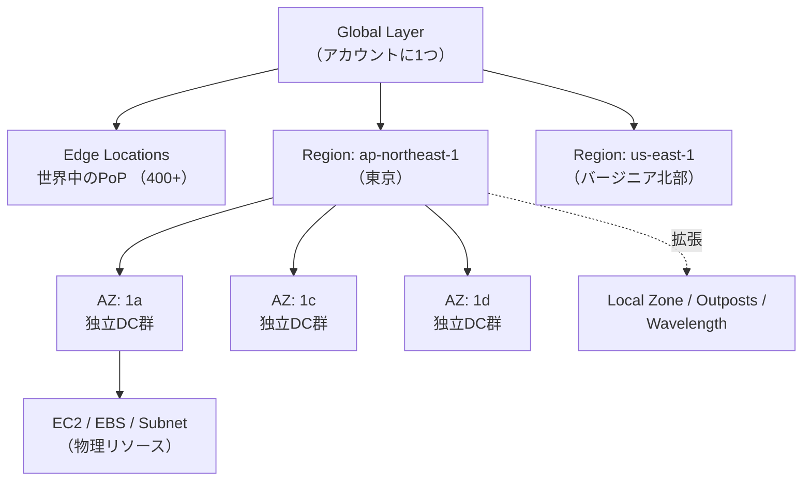

# AWS サービスの配置層 (Global / Region / AZ / Edge) / Visual Map

- 分類: Foundation (全カテゴリ共通の前提知識)
- 難易度: L1
- 包含カード:
  - `02_cards/network/vpc-concept.md` (作成予定)
  - `02_cards/compute/ec2-concept.md` (作成予定)
  - `02_cards/security/iam-concept.md` (作成予定)
  - `02_cards/storage/s3-concept.md` (作成予定)
  - `02_cards/network/route53-concept.md` (作成予定)
- 最終確認: 2026-04-26
- 次回予定: 2026-04-27

---

## ① 全体図

## ② 図内の各要素の役割 (spatial contiguity — 図の直下に配置)

| 層 | 定義 | 隣接概念との関係 | 主要サービス | 関連カード |
|---|---|---|---|---|
| **Global** | アカウントに1つだけ存在し、リージョン選択画面に出てこない層 | Region の上位。データは複数Regionに自動複製されることが多い | IAM, Organizations, Route 53, CloudFront, WAF, Shield, Global Accelerator, Billing | `security/iam-concept.md`, `network/route53-concept.md` |
| **Region** | 地理的に独立したAWSの大区画 (例: `ap-northeast-1`) | 内部に通常3〜6個のAZ。Region間は明示的に転送しない限り独立 | VPC, Lambda, S3, DynamoDB, RDS(論理), KMS, CloudWatch, ECS/EKS制御面 | `network/vpc-concept.md`, `storage/s3-concept.md` |
| **AZ** | Region内の物理的に独立したデータセンター群 | Subnetは必ず1AZに属す。AZ障害=そのAZ上のリソース全停止 | EC2 instance, EBS volume, Subnet, RDS DB instance, NAT Gateway, ENI | `compute/ec2-concept.md` |
| **Edge** | グローバル配信用PoP。Regionとは別軸で並列展開 | Regionの中ではなく外側に並列で存在 | CloudFront Edge, Lambda@Edge, CloudFront Functions | (CloudFront Conceptで作成) |
| **Region拡張** | 親Regionの延長として特定地点に配置 | 親Region経由で制御。Local Zone=低遅延都市、Wavelength=5G、Outposts=オンプレ | Local Zones, Wavelength, Outposts | (高度トピック) |

### ②-b Globalサービス詳細表

| サービス | 役割 | 重要度 |
|---|---|---|
| IAM | ユーザー・ロール・ポリシー管理 | ★★★ |
| Organizations | 複数アカウント統合管理 | ★★★ |
| Route 53 | DNS / ドメイン管理 | ★★★ |
| CloudFront | CDN | ★★★ |
| WAF (CF連携) | Webアプリケーションファイアウォール | ★★ |
| Shield | DDoS防御 | ★★ |
| Global Accelerator | グローバルロードバランサ | ★★ |
| Billing / Account | 請求・アカウント | ★★★ |
| Trusted Advisor / Health | 横断監視・推奨 | ★★ |
| Artifact | コンプライアンス文書 | ★ |

### ②-c Regionサービス詳細表 (カテゴリ別)

| カテゴリ | サービス |
|---|---|
| ネットワーク | VPC, Transit Gateway, Direct Connect Gateway, PrivateLink |
| コンピュート (制御面) | Lambda, ECS, EKS, Fargate(制御), Beanstalk, Batch |
| ストレージ | S3 (バケット), EFS, FSx |
| データベース | DynamoDB, RDS / Aurora, Redshift, DocumentDB, Neptune |
| メッセージング | SQS, SNS, EventBridge, Kinesis, MSK |
| セキュリティ | KMS, Secrets Manager, SSM Parameter Store, ACM, GuardDuty, Security Hub, Macie |
| 監視・運用 | CloudWatch, CloudTrail, Config, X-Ray |
| CI/CD・IaC | CloudFormation, CodePipeline, CodeBuild, CodeDeploy, ECR |
| アプリ統合 | API Gateway, Step Functions, AppSync |
| 認証 | Cognito |

### ②-d AZ層リソース詳細表

| リソース | 親サービス | AZ依存の理由 |
|---|---|---|
| EC2 instance | EC2 (Region) | 物理サーバ上で動くため必ず1AZに属す |
| EBS volume | EBS (Region) | 物理ディスク。同AZのEC2のみアタッチ可 |
| Subnet | VPC (Region) | Subnet = AZ + CIDR |
| RDS DB instance | RDS (Region) | 各インスタンスはAZ配置。Multi-AZは別AZにスタンバイ |
| NAT Gateway | VPC (Region) | AZごとに作成必須。怠るとAZ障害で全断 |
| ENI | VPC | Subnetに属するため自動的にAZ固定 |

### ②-e 層をまたぐ要注意サービス

| サービス | 混乱の理由 | 正しい理解 |
|---|---|---|
| S3 | バケット名はグローバル一意だがデータはRegion内 | コントロール=Global名前空間 / データ=Region |
| Route 53 | サービスはGlobalだがHealth CheckはRegionから実行 | コントロールプレーンはus-east-1依存 |
| DynamoDB Global Tables | 通常Regionだが、設定でグローバルレプリケート | 設定で性質が変わる |
| ACM | 通常Region、CloudFront用は必ず`us-east-1`で作成 | 例外として暗記 |
| IAM | GlobalだがSTSエンドポイントはRegion別 | Sessionトークン取得はRegion経由 |

---

## ③ データ・制御フロー

1. **認証フロー (Global → Region)**: ユーザー → IAM(Global)で認証 → STS(Region)でセッショントークン発行 → 各Regionサービスを操作
2. **DNS解決フロー (Global → Edge → Region)**: クライアント → Route 53(Global)でDNS解決 → CloudFront Edge(Edge)でキャッシュ判定 → ミス時にRegionのオリジン(S3/ALB等)へ
3. **アプリケーション配置フロー (Region → AZ)**: VPC(Region)を作成 → Subnet(AZ)を複数AZに配置 → EC2/RDS等のリソース(AZ)を各Subnetに配置 → ALB(Region)で複数AZのリソースを束ねて冗長化
4. **障害伝搬範囲**: AZ障害 → そのAZ上のリソースのみ停止 (Multi-AZ構成なら無影響) / Region障害 → そのRegion全体停止 (Multi-Region構成が必要) / Global障害 → 全体影響 (極めて稀)

---

## ④ 公式ドキュメント

- [AWSグローバルインフラストラクチャ](https://aws.amazon.com/jp/about-aws/global-infrastructure/)
- [リージョン、アベイラビリティーゾーン、Local Zones (EC2 ユーザーガイド)](https://docs.aws.amazon.com/ja_jp/AWSEC2/latest/UserGuide/using-regions-availability-zones.html)
- [AWS リージョン別サービス一覧 (Region Services List)](https://aws.amazon.com/jp/about-aws/global-infrastructure/regional-product-services/)
- [AWS ドキュメント トップ](https://docs.aws.amazon.com/ja_jp/)